# Flujos del sistema

Este documento resume como funciona el sistema de tesis a nivel operativo y tecnico. La idea es que sirva como guia para entender los recorridos principales de la aplicacion, las responsabilidades por rol y los puntos donde se guardan datos, se generan reportes o se consulta informacion.

El proyecto es una aplicacion Next.js con App Router. La capa web usa Better Auth para autenticacion y autorizacion, shadcn/ui para interfaz, CouchDB/PouchDB como base documental, BullMQ/Redis para trabajos asincronos y Carbone para algunos reportes PDF. El servicio de investigacion y ciencia de datos vive separado en `data-science/app` y se consume desde rutas proxy de la app.

## 1. Vision General

El sistema esta organizado alrededor de viajes/campanas. Un viaje define fechas, establecimiento, servicio y estaciones. Cada estacion tiene un docente encargado y estudiantes asignados. A partir de esa asignacion, la aplicacion decide que puede ver y hacer cada usuario.

Roles principales:

- `admin`: administra usuarios, viajes, reportes, rendimiento y dashboard centralizado.
- `docente`: revisa o registra historias de su estacion en el viaje activo asignado.
- `docente-organizador`: puede crear/listar viajes y tambien operar como docente.
- `docente-investigador`: accede a investigacion/ciencia de datos con permisos de lectura.
- `estudiante`: registra datos clinicos en la estacion asignada durante el viaje activo.

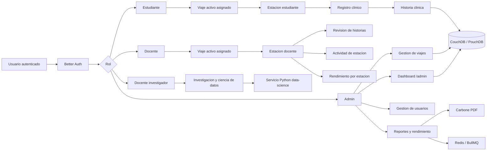

## 2. Autenticacion y Permisos

La autenticacion se maneja con Better Auth. Los permisos estan declarados en `src/lib/auth-roles.ts` sobre recursos como `viaje`, `estacion`, `actividad`, `user` y `session`.

Resumen por rol:

| Rol | Capacidades principales |
| --- | --- |
| `estudiante` | Leer viaje asignado, leer/escribir estacion, leer actividad propia. |
| `docente` | Leer viaje asignado, leer/escribir/revisar estacion, leer actividad de estacion. |
| `docente-organizador` | Crear/listar viajes y operar estaciones como docente. |
| `docente-investigador` | Leer/listar viajes y usar flujos de investigacion. |
| `admin` | Gestion total de usuarios, viajes, estaciones, actividad y reportes. |

El redirect posterior al login depende del rol y de la asignacion vigente. Para estudiantes y docentes, la resolucion del viaje activo se apoya en `src/lib/student-trip-resolution.ts`.

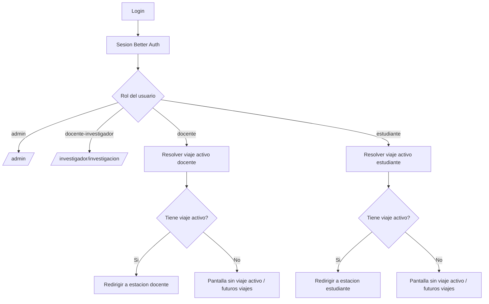

## 3. Viajes y Asignacion por Estacion

Un viaje es el documento central para organizar el trabajo. Su esquema base esta en `src/lib/schema/viajes.ts`.

Un viaje contiene:

- `servicio`
- `fechaEntrada`
- `fechaSalida`
- `establecimiento.nombre`
- `establecimiento.direccion`
- `establecimiento.contacto`
- `estaciones`

Cada estacion incluye:

- `tipo`
- `docenteEncargadoId`
- `estudiantesIds`

Tipos de estacion disponibles:

- Anamnesis
- Examen Fisico General
- Examen Fisico Segmentario
- Farmacia
- Laboratorios
- Electrocardiograma
- Espirometria
- Ecografia
- Recoleccion de Datos
- Diagnostico

La regla de acceso mas importante es que docente y estudiante trabajan sobre el viaje activo de hoy, usando zona horaria `America/La_Paz`, y solo si aparecen asignados en una estacion.

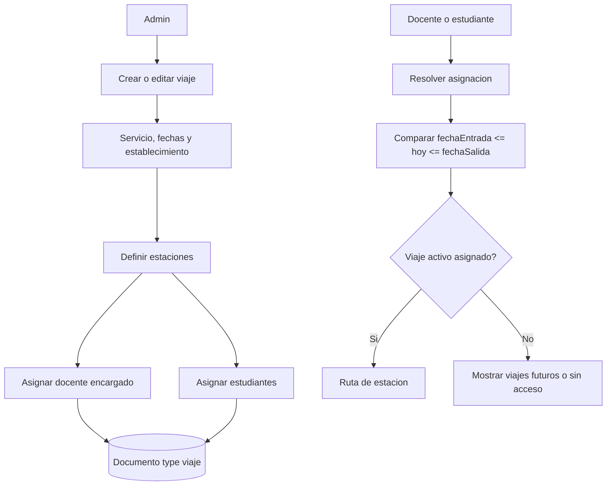

Rutas principales de viajes administrativos:

- `/admin/viajes`
- `/admin/viajes/create`
- `/admin/viajes/[id]/edit`
- `/admin/viajes/[id]/rendimiento`
- `/admin/viajes/[id]/pdf`
- `/admin/viajes/[id]/reporte`

## 4. Historia Clinica y Estaciones

La historia clinica se guarda como documento `type: "historia"`. Su estructura principal esta en `src/lib/schema/historia.ts`.

Campos principales:

- `pacienteId`
- `viajeId`
- `examenesComplementariosSolicitados`
- `anamnesis`
- `examenFisicoGeneral`
- `examenFisicoSegmentario`
- `electrocardiograma`
- `espirometria`
- `ecografia`
- `laboratorios`
- `diagnostico`
- `receta`
- `reporteHistoria`
- `reportesHistoria`

La historia no necesariamente nace completa. Se completa por estaciones. Cada estacion agrega o actualiza su bloque y deja trazabilidad mediante actividad/auditoria.

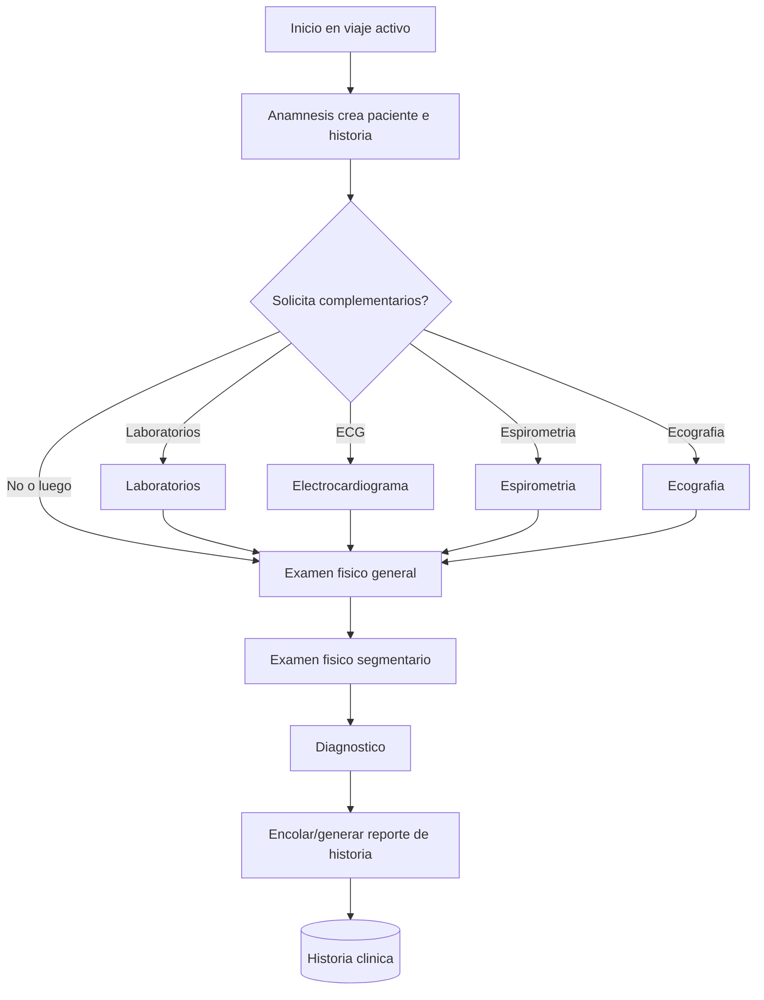

Notas del flujo:

- Anamnesis puede crear paciente e historia.
- Las estaciones complementarias solo deben aparecer cuando fueron solicitadas en `examenesComplementariosSolicitados`.
- Las datatables de estudiante muestran historias pendientes segun campos faltantes y complementarios solicitados.
- Las datatables de docente se limitan al viaje activo donde el docente esta asignado.
- Las paginas por `idHistoria` validan que la historia pertenezca a un viaje activo y a una estacion donde el usuario tenga asignacion.

Rutas de estudiante por estacion:

- `/estudiante/anamnesis`
- `/estudiante/anamnesis/create-historia`
- `/estudiante/examen-fisico-general`
- `/estudiante/examen-fisico-segmentario`
- `/estudiante/laboratorios`
- `/estudiante/electrocardiograma`
- `/estudiante/espirometria`
- `/estudiante/ecografia`
- `/estudiante/diagnostico`
- `/estudiante/farmacia/planeacion`

Rutas de docente por estacion:

- `/docente/anamnesis`
- `/docente/examen-fisico-general`
- `/docente/examen-fisico-segmentario`
- `/docente/laboratorios`
- `/docente/electrocardiograma`
- `/docente/espirometria`
- `/docente/ecografia`
- `/docente/diagnostico`
- `/docente/farmacia/planeacion`

## 5. Flujo del Estudiante

El estudiante entra al sistema, se resuelve su viaje activo y se lo redirige a la estacion donde esta asignado. Desde ahi trabaja solo las historias que corresponden a esa estacion.

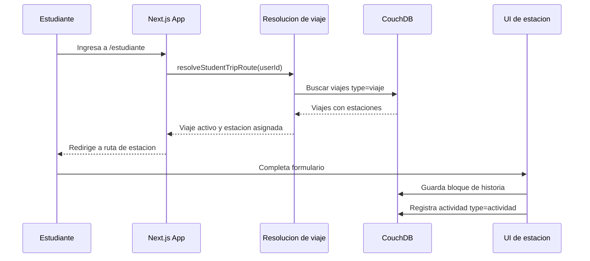

Reglas esperadas:

- Si no hay viaje activo, se muestra una pantalla informativa.
- Si hay viaje futuro, se puede mostrar como referencia, pero no habilita el trabajo clinico normal.
- El estudiante no debe ver historias fuera de su estacion asignada.
- Las acciones de guardado registran `created_by` o `updated_by` cuando corresponde.

## 6. Flujo del Docente

El docente tambien depende de viaje activo y estacion asignada. Su trabajo principal es revisar historias de su estacion, consultar actividad y ver rendimiento.

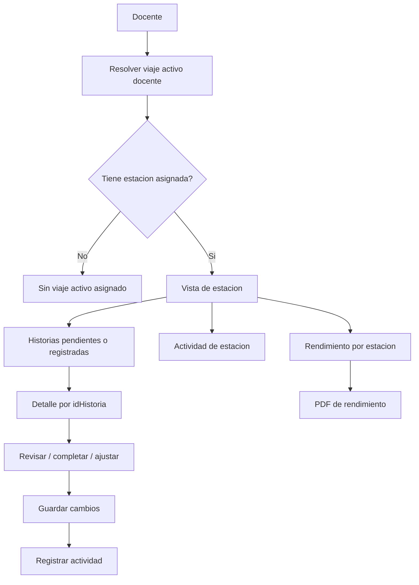

Vistas complementarias por estacion docente:

- `actividad`: muestra logs del viaje activo y de la estacion.
- `rendimiento`: muestra conteos reales por actor y categoria.
- `rendimiento/pdf`: genera PDF interno de rendimiento por estacion.

## 7. Actividad y Auditoria

La auditoria se guarda como documentos `type: "actividad"`. El registro se centraliza en `src/lib/activity-log.ts` y los tipos en `src/lib/schema/actividad.ts`.

Cada actividad guarda:

- `action`: `created` o `updated`
- `actorId`
- `stationKey`
- `viajeId`
- `viajeLabel`
- `historiaId`
- `pacienteId`
- `subject`: `historia` o `paciente`
- `changedFields`
- `changes`: lista de `{ field, before, after }`
- `createdAt`

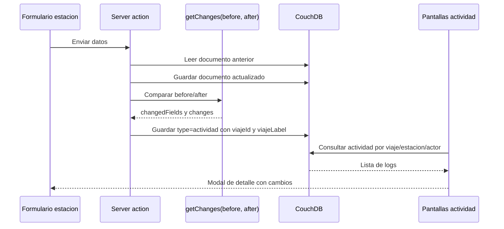

Comportamiento por contexto:

- Estudiante: ve actividad propia o de su estacion segun la pantalla.
- Docente: ve actividad del viaje activo y su estacion.
- Admin: ve actividad del viaje seleccionado en `/admin`.
- Dashboard admin: filtra por usuario, pagina con scroll infinito y abre modal de detalle.

Puntos importantes:

- Los logs deben tener siempre `viajeId` para poder filtrar correctamente.
- `viajeLabel` facilita mostrar contexto humano sin resolver el viaje cada vez.
- Para pacientes, la actividad se registra con `stationKey: "anamnesis"` porque el paciente nace en ese flujo.

## 8. Dashboard Administrativo

El dashboard principal esta en `/admin` y se apoya en:

- `src/app/admin/page.tsx`
- `src/app/admin/admin-dashboard.tsx`
- `src/lib/admin-dashboard.ts`
- `src/app/api/admin/dashboard/activity/route.ts`
- `src/app/api/admin/dashboard/change-stats/route.ts`

El dashboard gira alrededor de un viaje seleccionado. El selector es combobox/popover y persiste en `sessionStorage` con la clave `admin-dashboard-selected-trip`.

Elementos actuales:

- Selector de viaje.
- Grafico de resultados por diagnostico.
- Agrupacion de diagnosticos poco frecuentes en `Otros`.
- Popup de distribucion por genero al hacer click en una barra.
- Vista ampliada del grafico con scroll horizontal.
- Metricas de historias con cambios.
- Historial de actividad del viaje con filtro por usuario y scroll infinito.
- Modal de detalle de cambios.

```mermaid
flowchart TD
  Admin[Admin abre /admin] --> CargarResumen[getAdminDashboardSummary]
  CargarResumen --> Viajes[Listar viajes]
  Viajes --> Seleccion{Viaje en URL o sessionStorage?}
  Seleccion -->|Si| ViajeSeleccionado[Usar viaje seleccionado]
  Seleccion -->|No| PrimerViaje[Usar primer viaje disponible]

  ViajeSeleccionado --> Historias[Consultar historias del viaje]
  PrimerViaje --> Historias
  Historias --> Diagnosticos[Construir diagnosticos]
  Diagnosticos --> Otros[Agrupar diagnosticos poco frecuentes en Otros]
  Diagnosticos --> Genero[Preparar distribucion por genero]

  ViajeSeleccionado --> Actividad[Consultar actividad del viaje]
  Actividad --> Actores[Construir filtro de usuarios]
  Actividad --> Paginacion[Pagina inicial de logs]

  ViajeSeleccionado --> Cambios[/api/admin/dashboard/change-stats]
  Cambios --> Metricas[Historias con un cambio / 2+ cambios]

  Diagnosticos --> UI[UI dashboard]
  Genero --> UI
  Paginacion --> UI
  Metricas --> UI
```

Notas de implementacion del grafico:

- Recharts se usa dentro de `ChartContainer` de shadcn.
- El eje vertical de valores queda sticky a la izquierda.
- La barra horizontal persistente controla el `scrollLeft` real.
- En vista ampliada tambien funciona `Shift + scroll`.
- La nota del grafico explica que diagnosticos con pocos casos se juntan en `Otros`.

## 9. Investigacion y Ciencia de Datos

La interfaz de investigacion existe para admin e investigador:

- `/admin/investigacion`
- `/investigador/investigacion`
- tambien hay rutas historicas `/admin/ciencia-datos` y `/investigador/ciencia-datos`.

La UI principal es `src/components/data-science/data-science-chat.tsx`. La app Next proxy hacia el servicio Python mediante `src/app/api/data-science/[...path]/route.ts`.

El selector de viajes en el chat:

- Es combobox/popover.
- Permite seleccion multiple.
- Busca por lugar, servicio o fecha.
- Carga opciones incrementalmente.
- Usa `GET /api/investigacion/viajes`.

El backend Python:

- Vive en `data-science/app`.
- Usa un agente con herramientas de solo lectura.
- No da acceso directo al modelo a CouchDB.
- Aplica filtros de viajes/estacion desde la interfaz.
- Si el agente falla o no produce artifacts esperados, se usa flujo deterministico como respaldo.

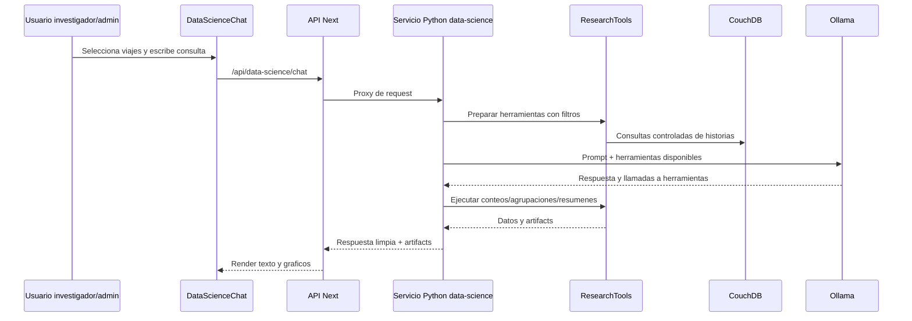

Cruces automaticos definidos:

- Genero: distribucion por viaje.
- Diagnosticos/enfermedades: distribucion por genero y grupo de edad.
- Indicadores numericos: registros, promedio, minimo y maximo.
- `edad` y `grupoEdad` se calculan desde `fechaNacimiento` cuando se construyen filas de historias.

## 10. Farmacia e Inventario por Viaje

Farmacia es una estacion especial enfocada en planeacion de inventario por viaje. No registra aun las mismas pantallas de actividad/rendimiento que las estaciones clinicas.

Rutas:

- `/estudiante/farmacia` redirige a `/estudiante/farmacia/planeacion`
- `/docente/farmacia` redirige a `/docente/farmacia/planeacion`

Archivos clave:

- `src/lib/schema/farmacia.ts`
- `src/lib/farmacia.ts`
- `src/lib/farmacia-actions.ts`
- `src/components/farmacia/farmacia-planeacion-page.tsx`
- `src/components/farmacia/farmacia-planeacion-form.tsx`

Reglas:

- El inventario se guarda por `viajeId`.
- El acceso se permite si el usuario esta asignado a Farmacia en el viaje activo o en un viaje futuro.
- Durante el viaje no se consulta AGEMED ni internet.
- Se usa catalogo local/offline guardado en CouchDB.
- Los medicamentos se normalizan con principio activo, concentracion, forma farmaceutica, via, registro sanitario, laboratorio/titular y nombre comercial cuando exista.
- Insumos/equipos/otros se registran como inventario manual.

```mermaid
flowchart TD
  Usuario[Docente o estudiante Farmacia] --> Resolver[Resolver viaje Farmacia]
  Resolver --> ActivoOFuturo{Farmacia asignada en viaje activo o futuro?}
  ActivoOFuturo -->|No| SinAcceso[Sin acceso a planeacion]
  ActivoOFuturo -->|Si| Planeacion[/farmacia/planeacion]

  Planeacion --> Catalogo[Catalogo medicamento local]
  Planeacion --> Manual[Item manual: insumo/equipo/otro]

  Catalogo --> Normalizar[Normalizar datos AGEMED offline]
  Normalizar --> GuardarCatalogo[(type medicamentoCatalogo)]
  Normalizar --> GuardarInventario[(type viajeInventarioItem)]
  Manual --> GuardarInventario

  GuardarInventario --> ViajeId[Inventario ligado a viajeId]
```

## 11. Reportes

El sistema maneja reportes de historia, viaje y rendimiento.

### 11.1 Reporte de historia clinica

Archivos:

- `src/lib/reports/historia-carbone-report.ts`
- `src/app/reportes/historias/[idHistoria]/route.ts`
- `src/lib/queues/reportes.ts`
- `scripts/reporte-historia-worker.mjs`

Al guardar diagnostico se encola la generacion del reporte de historia. El worker consume la cola, genera PDF con Carbone y guarda el archivo en storage.

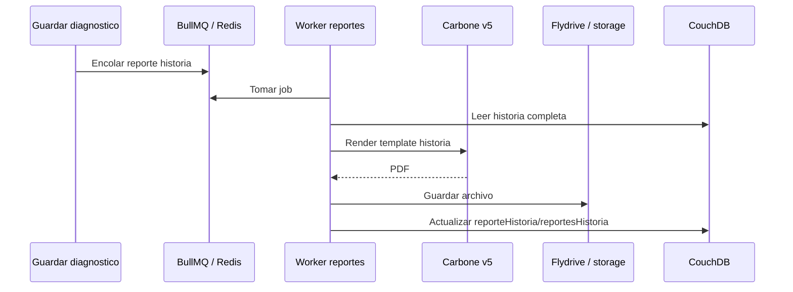

Ruta manual:

- `/reportes/historias/[idHistoria]`

### 11.2 Reporte de viaje

Archivos:

- `src/lib/reports/viaje-students-report.ts`
- `src/app/admin/viajes/[id]/pdf/route.ts`
- `src/app/admin/viajes/[id]/reporte/route.ts`

Rutas:

- `/admin/viajes/[id]/pdf`: descarga PDF.
- `/admin/viajes/[id]/reporte`: abre PDF inline.

Contenido principal:

- Servicio.
- Fechas.
- Establecimiento.
- Estaciones.
- Docente encargado por estacion.
- Estudiantes por estacion.

### 11.3 Rendimiento por estacion y por viaje

Archivos:

- `src/lib/docente-station-performance.ts`
- `src/components/docente/station-performance-page.tsx`
- `src/components/docente/station-performance-chart.tsx`
- `src/lib/reports/docente-station-performance-pdf.ts`

Rutas docentes:

- `/docente/{estacion}/rendimiento`
- `/docente/{estacion}/rendimiento/pdf`

Rutas admin:

- `/admin/viajes/[id]/rendimiento`
- `/admin/viajes/[id]/rendimiento/pdf`
- `/admin/viajes/[id]/rendimiento/[stationKey]/pdf`

El rendimiento usa conteos reales:

- Registros completados.
- Historias tocadas.
- Actividad total.
- Creaciones.
- Ediciones.
- Historias creadas por actor.
- Pacientes creados por actor.
- Datos editados por actor.
- Ultima actividad.

## 12. Seeders y Datos de Prueba

Seeders principales:

- `scripts/seed-users.mjs`
- `scripts/seed-historias.mjs`

Comandos:

```bash
pnpm seed:users
pnpm seed:historias
pnpm seed:historias -- --dry-run
pnpm seed:historias -- --reset-db
```

El seeder de historias genera:

- 1000 historias por defecto.
- 6 viajes.
- Al menos 100 historias por viaje.
- Diagnosticos variados.
- Complementarios.
- Updates.
- Logs de actividad alineados a las fechas del viaje.
- `viajeId` y `viajeLabel` en actividad.

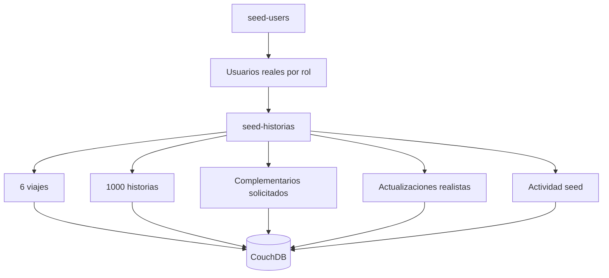

Notas:

- `--dry-run` permite revisar sin escribir.
- `--reset-db` borra documentos seed relevantes antes de regenerar. Debe usarse con cuidado.
- El seeder ya no usa `_all_docs`; usa Mango con `idx_type`.

## 13. Persistencia y Consultas

La base documental se consulta con PouchDB/CouchDB y Mango queries.

Puntos importantes:

- Antes de consultas Mango se debe ejecutar `ensureTesisIndexes()`.
- `findTesisDocs()` centraliza consultas.
- No reintroducir `_all_docs` para listados grandes.
- CouchDB no soporta ordenamiento Mango con direcciones mezcladas; cuando haga falta, usar sort de una direccion o resolver en memoria.

Indices relevantes mencionados por los flujos:

- `idx_type`
- `idx_historias_viaje`
- `idx_viaje_inventario_viaje`
- `idx_medicamento_catalogo_fuente`

Documentos principales:

| Tipo | Uso |
| --- | --- |
| `viaje` | Campanas, fechas, establecimiento y asignaciones. |
| `historia` | Historia clinica por paciente y viaje. |
| `actividad` | Auditoria de creaciones y actualizaciones. |
| `viajeInventarioItem` | Inventario de Farmacia por viaje. |
| `medicamentoCatalogo` | Catalogo local/offline de medicamentos. |

## 14. Mapa Rapido de Archivos

| Area | Archivos principales |
| --- | --- |
| Roles y permisos | `src/lib/auth-roles.ts`, `src/lib/auth-role-values.ts`, `src/lib/role-redirect.ts` |
| Viajes | `src/lib/schema/viajes.ts`, `src/app/admin/viajes/*`, `src/lib/student-trip-resolution.ts` |
| Historias | `src/lib/schema/historia.ts`, `src/lib/station-histories.ts`, `src/components/forms/*` |
| Actividad | `src/lib/activity-log.ts`, `src/lib/activity-queries.ts`, `src/components/activity/*` |
| Dashboard admin | `src/app/admin/admin-dashboard.tsx`, `src/lib/admin-dashboard.ts`, `src/app/api/admin/dashboard/*` |
| Ciencia de datos | `src/components/data-science/data-science-chat.tsx`, `data-science/app/*`, `src/app/api/data-science/[...path]/route.ts` |
| Farmacia | `src/lib/farmacia.ts`, `src/lib/farmacia-actions.ts`, `src/lib/schema/farmacia.ts`, `src/components/farmacia/*` |
| Reportes | `src/lib/reports/*`, `src/lib/queues/reportes.ts`, `scripts/reporte-historia-worker.mjs` |
| Seeders | `scripts/seed-users.mjs`, `scripts/seed-historias.mjs` |

## 15. Flujo Integrado de Extremo a Extremo

Este diagrama junta el ciclo principal: se crea un viaje, se asigna personal, se levantan historias, se audita la actividad, se analiza informacion y se generan reportes.

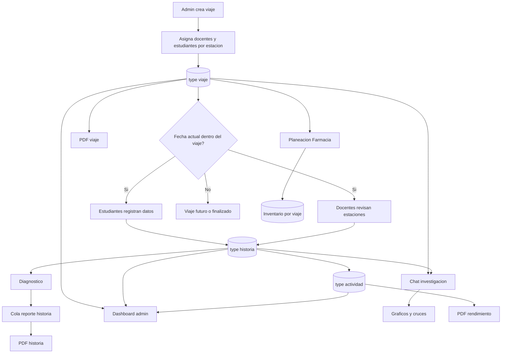

## 16. Reglas que No Conviene Romper

- No listar historias masivamente con `_all_docs`; usar Mango e indices.
- Mantener `viajeId` en historias, actividad e inventario.
- Mantener `viajeLabel` en actividad para UI y reportes.
- Validar viaje activo y asignacion antes de permitir acciones de docente/estudiante.
- Respetar complementarios solicitados para mostrar pendientes.
- No consultar AGEMED/internet durante el viaje; Farmacia usa catalogo local.
- No usar `carbone-sdk` para templates numericos v5; usar `fetch` directo con headers esperados.
- No ejecutar procesos de servidor o workers automaticamente durante cambios de documentacion.

## 17. Base para Diccionario de Datos

Para construir un diccionario de datos completo no conviene inventar campos desde las pantallas. La fuente principal deben ser los esquemas y tipos que definen como se guardan los documentos en CouchDB/PouchDB.

Fuentes recomendadas:

- `src/lib/schema/*.ts`: fuente principal para entidades clinicas y documentos persistidos.
- `src/lib/db.ts`: union de documentos reconocidos por la base (`TesisDocument`) y tipos que entran al almacenamiento.
- `src/lib/db-indexes.ts`: indices Mango existentes; ayuda a identificar campos consultados frecuentemente.
- `src/lib/activity-log.ts` y `src/lib/schema/actividad.ts`: estructura real de auditoria.
- `src/lib/admin-dashboard.ts`: campos derivados usados por dashboard, especialmente diagnosticos, actividad y metricas.
- `src/lib/farmacia.ts`, `src/lib/farmacia-actions.ts` y `src/lib/schema/farmacia.ts`: inventario por viaje y catalogo local de medicamentos.
- `src/lib/reports/*.ts`: shape enviado a reportes PDF, especialmente cuando se transforma informacion antes de imprimir.
- `scripts/seed-historias.mjs`: ejemplos realistas de datos, viajes, historias, complementarios, diagnosticos y logs.
- `src/components/forms/*.tsx`: ayuda a entender etiquetas visibles, campos requeridos por UI y agrupacion por formulario, pero no debe reemplazar a los esquemas.

Entidades minimas que deberia cubrir el diccionario:

- Usuario/rol, tomando en cuenta Better Auth y roles internos.
- Viaje.
- Estacion del viaje.
- Paciente.
- Historia clinica.
- Anamnesis.
- Examen fisico general.
- Examen fisico segmentario.
- Laboratorios.
- Electrocardiograma.
- Espirometria.
- Ecografia.
- Diagnostico.
- Examenes complementarios solicitados.
- Actividad/auditoria.
- Reporte de historia.
- Inventario de Farmacia por viaje.
- Catalogo local de medicamentos.

Columnas sugeridas para la tabla del diccionario:

- Entidad/documento.
- Campo.
- Tipo de dato.
- Obligatorio.
- Descripcion.
- Origen o archivo fuente.
- Ejemplo de valor.
- Observaciones/reglas.

Notas para elaborarlo:

- Si un campo existe solo como dato derivado de UI o reporte, marcarlo como "derivado" y no como persistido.
- Si un campo esta dentro de un objeto anidado, usar notacion con punto, por ejemplo `establecimiento.nombre`.
- Si un campo pertenece a un arreglo, indicar el contenedor, por ejemplo `estaciones[].tipo`.
- Diferenciar entre documentos persistidos (`type: "historia"`, `type: "viaje"`, etc.) y estructuras internas usadas solo para vistas.
- Revisar los seeders para obtener ejemplos de valores, pero no asumir que todo valor del seeder es una regla del dominio.
